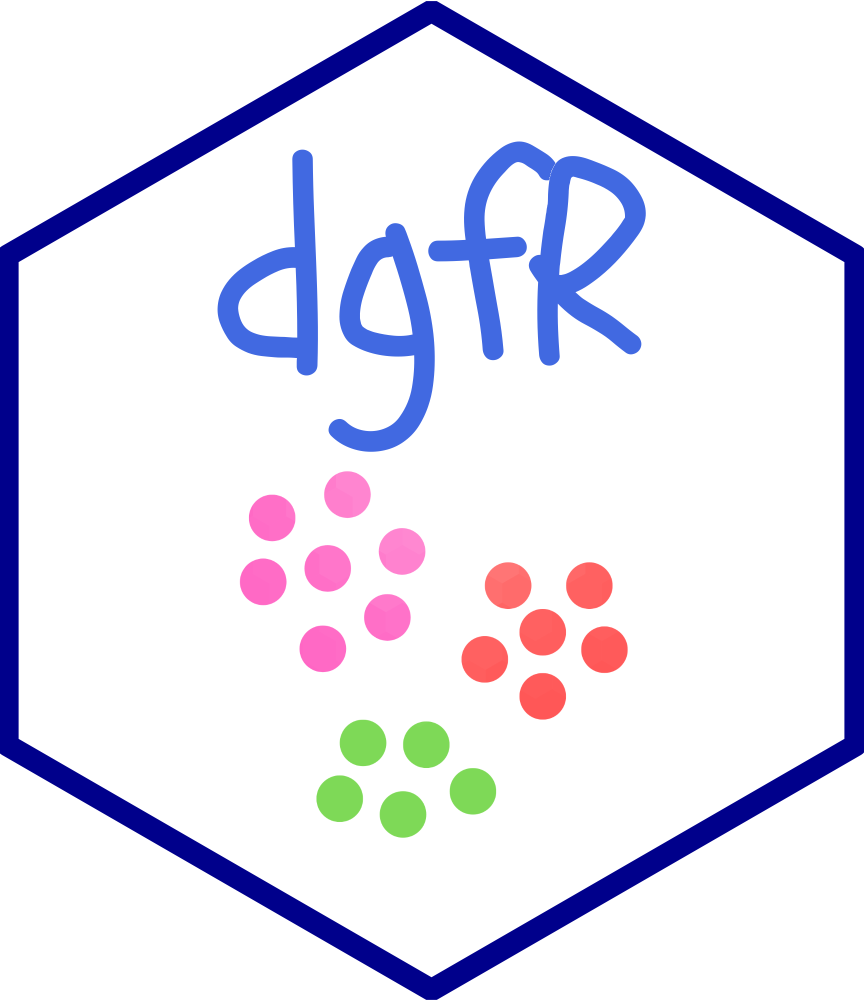

<!-- README.md is generated from README.Rmd. Please edit that file -->

```{r, include = FALSE}
knitr::opts_chunk$set(
  collapse = TRUE,
  comment = "#>",
  fig.path = "man/figures/README-",
  out.width = "100%"
)
```

# dgfr package 

<!-- badges: start -->
<!-- badges: end -->

The purpose of the dgfr package is to enable the visualization of sequence diversity within gene/protein families. In addition, it is also possible to determine the optimal number of clusters for grouping members of gene families based on sequence similarity and to calculate the mean/median similarity inside each cluster.

## Installation
Before proceeding to the installation of the dgfr package, you must install the following dependencies:

```{r, message=FALSE, warning=FALSE}
if (!requireNamespace("BiocManager", quietly = TRUE)) {
    install.packages("BiocManager")
}
BiocManager::install("Biostrings", dependencies = TRUE)
```

Now you can install the `dgfr` package using the following command:

```{r, message=FALSE}
# install.packages("devtools")
#devtools::install_github("lailaviana/dgfr")
library(dgfr)
```

## How to use?

1. First, retrieve the FASTA sequences of the gene family being studied from the database of your choice. The fasta file must be loaded inside R using the Biostrings::readAAStringSet() in case of protein sequences or Biostrings::readDNAStringSet() in case of nucleotide sequences. 

```{r}
fasta_file <- Biostrings::readAAStringSet("data-raw/fasta")
```

If you prefer, you might use a sample dataset provided by the package. The dataset is named `fasta` and contains 75 protein sequences and you can load it using the following command:

```{r}
fasta_file <- data(fasta)
```


2. The object containing your fasta should be provided to the first function named `get_alignment_score`, then you should also provide the type o sequence "nuc" for nucleotide or "prot" for protein, the alignment method ("global" or "local") and the number of cores to be used in the analysis. The score is calculated using the following formula:
  - algn_seq1seq2 / (sqrt(algn_seq1seq1) * sqrt(algn_seq2seq2))  
This formula was first proposed by Bleakley and Yamanashi and is a way to normalize the score by the length of the alignment.
The output will be a dataframe containing the score of each pairwise alignment among all sequences provided.

```{r}
score_file <- dgfr::get_alignment_score(fasta = fasta,
                                        type = "prot",
                                        alignment_method = "global",
                                        cores = 4)
```


3. The output of the first function of the package, should be provided to the second function called `create_distance_matrix`. This function calculates the average Euclidian distance between the score of each pairwise alignment.

```{r}
distance_matrix <- dgfr::create_distance_matrix(score_file = score_file)
```

4. After generating the distance matrix, we will use the `get_variance` function to access the variability explained by each axis. This requires the provision of the file containing the distance matrix. In general, a cumulative value of 70% or higher for the axis is considered adequate for explaining the data’s variance. 

```{r}
variance <- dgfr::get_variance(distance_matrix = distance_matrix)
variance |> dplyr::select(1:3)
```

5. The subsequent required step consists of a multidimensional scaling (MDS) of the data matrix. The output will consist of the name of the sequence and its position on axes 1 and 2. 

```{r}
dim_reduced_file <- dgfr::dim_reduction(distance_matrix = distance_matrix)
head(dim_reduced_file)
```

6. A possible functionality of the dgfr package is to determine the optimal number of clusters in the dataset. You must provide the dimension-reduced file and, if desired, the minimum and maximum number of clusters to be identified. If you do not provide these values, the script will automatically search between 2 and 20 clusters.

```{r, message=FALSE, results='hide', fig.show='hide'}
kmeans_output <- dgfr::kmeans_clustering(dim_reduced_file = dim_reduced_file)
```

Finally, you will have a table containing the name of each sequence, its position on axes 1 and 2, and the cluster to which the sequence belongs.

```{r}
head(kmeans_output)
```

7. The next function, allows you to visualize the sequences and its cluster in a tree-like structure. You must provide the `kmeans_clustering` function output and the `create_distance_matrix` output. The output will be a plot containing the sequences and its cluster.

```{r, out.width="60%", fig.align='center'}
tree <- dgfr::create_tree(distance_matrix = distance_matrix,
                kmeans_output = kmeans_output)

tree
```


8. Finally, you can access the mean/median similarity among each cluster using the function `similarity_cluster`. This function takes as argument the `kmeans_clustering` function output, the `get_alignment_score` output and you must also choose between two possible visualizations output. The "table" output returns a table containing the mean and median similarity among all clusters and the number of genes inside each cluster.   

```{r, fig.align='center'}
dgfr::similarity_cluster(score_file = score_file,
                         kmeans_output = kmeans_output,
                         output_type = "table")
```
The "plot" output returns a plot containing a violin plot highlighting the distribution of similarity within each cluster.  

```{r, out.width="60%", fig.align='center'}
dgfr::similarity_cluster(score_file = score_file,
                         kmeans_output = kmeans_output,
                         output_type = "plot")
```


## Data visualisation suggestions
All visualization suggestions presented here were created using the `ggplot2` package. However, you are allowed to use your preferred package or tool to visualize the obtained data.

### Visualizing gene family dispersion
The simplest form of visualization is the scatter plot of sequences from a particular gene family, where each point represents a sequence, and the distance between two points is proportional to the similarity of these sequences.


```{r, out.width="60%", fig.align='center'}
kmeans_output |> 
  ggplot2::ggplot(
    ggplot2::aes(x = axis_1, 
                 y = axis_2)) + 
  ggplot2::geom_point(size = 3.5, alpha = 0.3) +
  ggplot2::theme_bw() +
  ggplot2::labs(x = round(variance$`1`, 2), 
                y = round(variance$`2`, 2))
```


### Identifying particular sequences within the gene family
The second suggested plot is similar to the first, but it allows for the highlighting of sequences of interest. In addition to `ggplot2`, `gghighlight` and `ggrepel` are required to perform this analysis.


```{r, out.width="60%", fig.align='center'}
seq_name <- kmeans_output |> 
  dplyr::sample_n(5) |> 
  dplyr::select(name) |> 
  dplyr::pull()

kmeans_output |> 
  ggplot2::ggplot(
    ggplot2::aes(x = axis_1, 
                 y = axis_2)) + 
  ggplot2::geom_point(size = 3.5, alpha = 0.3) +
  ggplot2::theme_bw() +
  ggplot2::labs(x = round(variance$`1`, 2), 
                y = round(variance$`2`, 2)) +
gghighlight::gghighlight(name %in% seq_name) + 
  ggrepel::geom_text_repel(label = seq_name, 
                           min.segment.length = 0, 
                           seed = 42, 
                           box.padding = 0.5)

```

### Identifying the number of clusters within the gene family
In this third visualization suggestion, the gene family is divided into an optimal number of groups, each of which represented by a different color.  


```{r, out.width="60%", fig.align='center'}
kmeans_output |> 
  dplyr::mutate(cluster = as.character(cluster)) |> 
  ggplot2::ggplot(
    ggplot2::aes(x = axis_1, 
                 y = axis_2,
                 color = cluster)) + 
  ggplot2::geom_point(size = 3.5, alpha = 0.3) +
  ggplot2::theme_bw() +
  ggplot2::labs(x = round(variance$`1`, 2), 
                y = round(variance$`2`, 2))
```

### Aggregating and visualizing RNAseq data
Another functionality is to integrate RNAseq data to visualize the expression and dispersion of the gene family in the scatter plot. The size of the points is proportional to the gene expression level of each family member, with small points representing genes with low expression and large points representing genes with high expression.


```{r, out.width="60%", fig.align='center'}
kmeans_out_l2fc <- kmeans_output |> 
  dplyr::mutate(l2fc = runif(75, min = 0.1, max = 4))

kmeans_out_l2fc |> 
  dplyr::mutate(cluster = as.character(cluster)) |> 
  ggplot2::ggplot(
    ggplot2::aes(x = axis_1, 
                 y = axis_2,
                 color = cluster)) + 
  ggplot2::geom_point(size = kmeans_out_l2fc$l2fc, alpha = 0.3) +
  ggplot2::theme_bw() +
  ggplot2::labs(x = round(variance$`1`, 2), 
                y = round(variance$`2`, 2))
```

## Warranty
If you find any bugs or incorrect information, please open an issue.

## Acknowledgment
The development of this package would not have been possible without the knowledge shared by the instructors at [curso-R](https://github.com/curso-r), mainly Beatriz Milz, Caio Lente and Júlio Trecenti.


